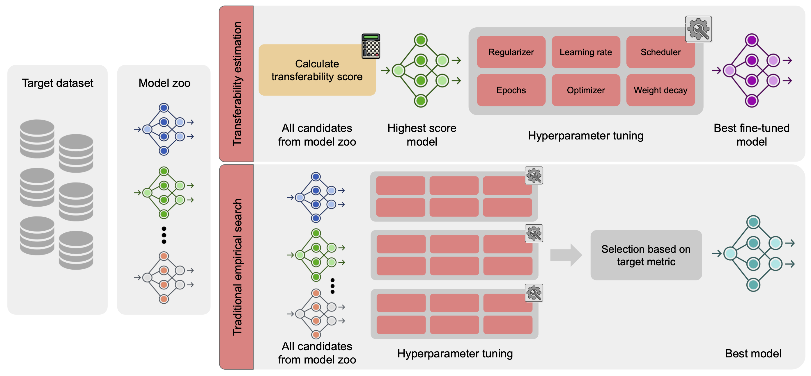
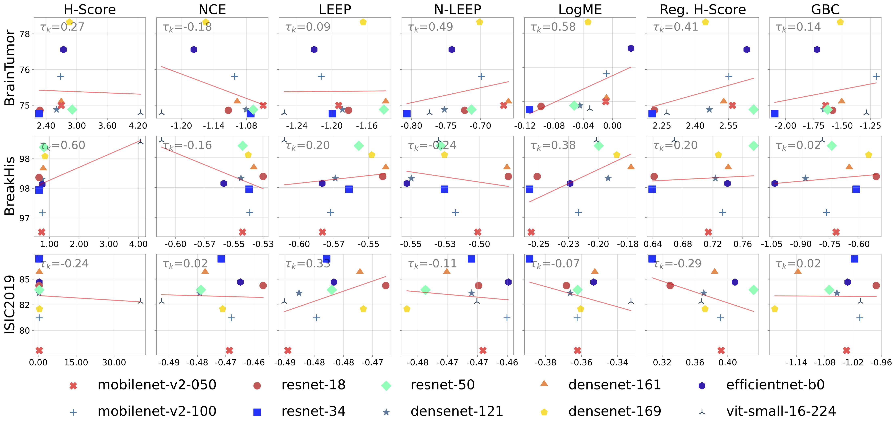

# The Performance of Transferability Metrics does not Translate to Medical Tasks

This repository hosts the code for the experiments in the DART 2023 paper [The Performance of Transferability Metrics does not Translate to Medical Tasks](https://arxiv.org/abs/2308.07444)



## Requirements 
The development environment is described in `requirements.txt` file.

## Datasets 
The datasets files (images) can be downloaded from the following links:

| Dataset     | URL                                                                                      |
|-------------|------------------------------------------------------------------------------------------|
| ISIC19      | https://challenge.isic-archive.com/data/#2019                                            |
| PAD-UFES-20 | https://data.mendeley.com/datasets/zr7vgbcyr2/1                                          |
| BreakHis    | https://web.inf.ufpr.br/vri/databases/breast-cancer-histopathological-database-breakhis/ |
| ICIAR 2018  | https://zenodo.org/record/3632035                                                        |
| BrainTumor  | https://drive.google.com/file/d/1v4OJdOMHXOrjloV9HhgGnB8KeneDf4Nj/view?usp=share_link    |
| NINS        | https://drive.google.com/file/d/1OVVvqPLr-RIVklTGTeSgmRVxiM3OhTFt/view?usp=share_link    |

All training, validation and testing splits can be found in `/data/` folder.

By default, `custom_dataset.py` reads the CSV file and expects to have both `image` (image path) and `label` (label id)
columns in the CSV. If you intend to extract and setup each folder in a different folder structure, please modify the 
original CSV in `/data/` or use the `imgs_folder` parameter to setup the paths correctly. 

## Fine-tuning models

We provide a single finetune_model.py to run the fine-tuning using our protocol. In the following example, 
fine-tune a renet50 on isic19 dataset. 
```
python3 finetune_models --lr 1e-3 --wd 1e-3 --model resnet50 --clf_layer fc --train_csv ./data/isic19/train_split_01.csv --val_csv ./data/isic19/val_split_01.csv --pretrained  
```

Some training arguments: 
- `lr`: Learning rate
- `wd`: Weight decay
- `model`: Which neural network to fine-tuning
- `clf_layer`: Layer before classification layer (to adapt the classification head to the target domain)
- `train_csv`: Path to train CSV
- `val_csv`: Path to valid CSV
- `--pretrained`: If loads pre-trained model on ImageNet.


## Transferability Scorers

| Metric        | URL                                          |
|---------------|----------------------------------------------|
| H-Score       | https://ieeexplore.ieee.org/document/8803726 |
| NCE           | https://arxiv.org/abs/1908.08142             |
| LEEP          | https://arxiv.org/abs/2002.12462             |
| N-LEEP        | https://arxiv.org/abs/2011.11200             |
| LogME         | https://arxiv.org/abs/2102.11005             |
| Reg.  H-Score | https://arxiv.org/abs/2110.06893             |
| GBC           | https://arxiv.org/abs/2111.12780             |

To calculate the ImageNet pre-trained transferability scores for all scorers on a given dataset:  
```
python3 calc_transf_metrics.py --test_split isic19 --model resnet50 --layer fc
```

For transferability scores and test performances on OOD datasets:  

```
python3 calc_transf_metrics.py --test_split isic19_ood --model resnet50 --layer fc --ckpt_path /path/to/isic19_ft_resnet50.ckpt 
```

If you prefer to 

## Results

All code and data to reproduce the Fig. 3 of the paper are in `./results/` folder. 




## Acknowledgments 

- L. Chaves is funded by Becas Santander/Unicamp – HUB
2022, Google LARA 2021, in part by the Coordena ̧c ̃ao de Aperfei ̧coamento de
Pessoal de Nível Superior – Brasil (CAPES) – Finance Code 001, and FAEPEX.
- A. Bissoto is funded by FAPESP (2019/19619-7, 2022/09606-8). 
- S. Avila is
funded by CNPq 315231/2020-3, FAPESP 2013/08293-7, 2020/09838-0, H.IAAC,
Google LARA 2021 and Google AIR 2022.

